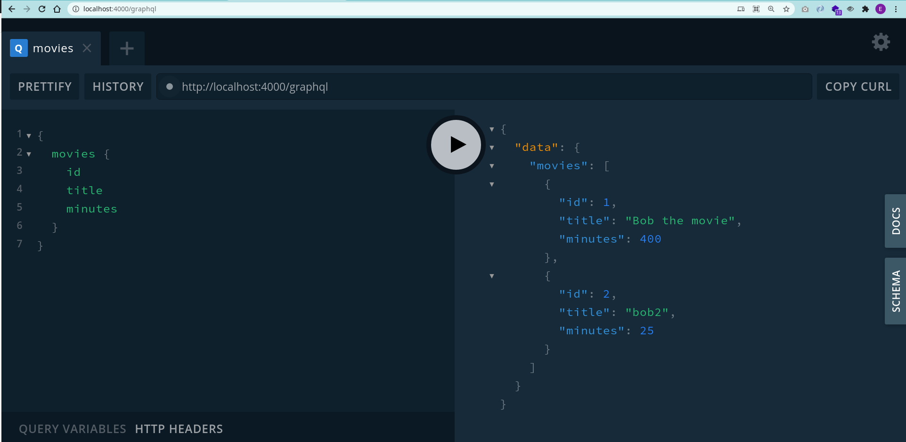

# Typescript GraphQl CRUD Example

A example repository to show how you can create your first GraphQL Restful with TS and not JS.



## Getting start

```
yarn install
yarn start
```

And open `http://localhost:4000/graphql`

## Examples

### Insert/Create
```
mutation { 
 createMovie(
  options: {
    title: "bob3", minutes: 10
  }) {
    id
    title
    minutes
  }
}
```

### Update

```
mutation {
  updateMovie(id: 30
  input: {
    title: "New bob"
  })
}
```

### Select
```
{
  movies {
    id
    title
    minutes
  }
}
```

#### Delete

```
mutation {
  deleteMovie(id: 3)
}
```

## References

https://www.youtube.com/watch?v=WhzIjYQmWvs

I fixed some minor changes to works with the latest version of `graphql-api`.

© Copyright 2021, Max Base
